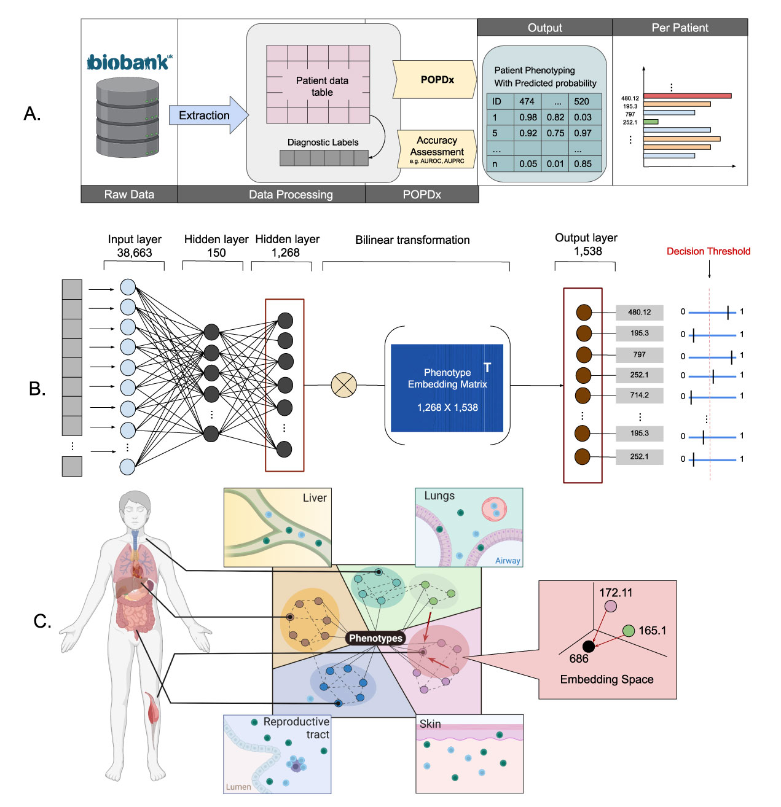

# POPDx: An Automated Framework for Patient Phenotyping across 392,246 Individuals in the UK Biobank Study 
POPDx (Population-based Objective Phenotyping by Deep Extrapolation) is a bilinear machine learning framework for simultaneous multi-phenotype recognition. For additional information, please refer to our manuscript, available at https://academic.oup.com/jamia/advance-article/doi/10.1093/jamia/ocac226/6873915. 

To cite: 

Lu Yang, Sheng Wang, Russ B Altman, POPDx: an automated framework for patient phenotyping across 392 246 individuals in the UK Biobank study, Journal of the American Medical Informatics Association, 2022;, ocac226, https://doi.org/10.1093/jamia/ocac226




## Tools for UK Biobank

## Installation
Please clone our github repository as follows:
```
git clone https://github.com/luyang-ai4med/POPDx.git
```
## Dependencies
POPDx is developed in Python 3. We provide an conda environment containing the necessary dependencies. 
For your experiments, we suggest using a single GPU (e.g. NVIDIA Tesla V100 SXM2 16 GB). 
```
conda env create -f popdx.yml
conda activate popdx
```
## Label embeddings 
Please refer to the sample notebook for generating the ICD-10/Phecode embeddings. 
https://github.com/luyang-ai4med/POPDx/blob/2035055b9b7d530634cb34d99b4f500c54c5fb06/code/create_label_embeddings.ipynb#L1-L6

## POPDx training
POPDx can be explored and run through the command lines as follows: 
```
python code/POPDx_train.py -h
python code/POPDx_train.py -d './save/POPDx_train' 
```
Additional parameters can be defined by the user. 

```
The script to train POPDx. 
Please specify the train/val datasets path in the python script.

optional arguments:
  -h, --help            show this help message and exit
  -d SAVE_DIR, --save_dir SAVE_DIR
                        The folder to save the trained POPDx model e.g.
                        "./save/POPDx_train"
  -s HIDDEN_SIZE, --hidden_size HIDDEN_SIZE
                        Default hidden size is 150.
  --use_gpu USE_GPU     Default setup is to use GPU.
  -lr LEARNING_RATE, --learning_rate LEARNING_RATE
                        Default learning rate is 0.0001
  -wd WEIGHT_DECAY, --weight_decay WEIGHT_DECAY
                        Default weight decay is 0
```
## POPDx testing
POPDx can be tested through the command lines as follows: 
```
python code/POPDx_test.py -h 
python code/POPDx_test.py -m "./save/POPDx_train/best_classifier.pth.tar" -o "./save/POPDx_train/test/"
```
Additional parameters can be defined by the user. 
```
usage: POPDx_test.py [-h] -m MODEL_PATH -o OUTPUT_PATH [-s HIDDEN_SIZE]
                     [-b BATCH_SIZE] [--use_gpu USE_GPU]

The script to test POPDx. 
Please specify the path to the test datasets in the python script.

optional arguments:
  -h, --help            show this help message and exit
  -m MODEL_PATH, --model_path MODEL_PATH
                        The path to POPDx model e.g.
                        "./save/POPDx_train/best_classifier.pth.tar"
  -o OUTPUT_PATH, --output_path OUTPUT_PATH
                        The output directory e.g. "./save/POPDx_train/test/"
  -s HIDDEN_SIZE, --hidden_size HIDDEN_SIZE
                        Default hidden size is 150. Consistent with training.
  -b BATCH_SIZE, --batch_size BATCH_SIZE
                        Default batch size is 512.
  --use_gpu USE_GPU     Default setup is to not use GPU for test.
```
